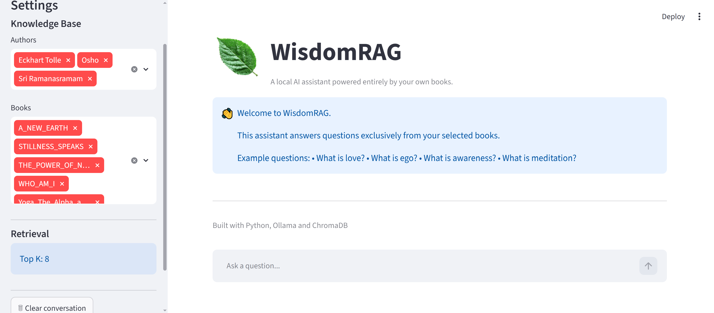
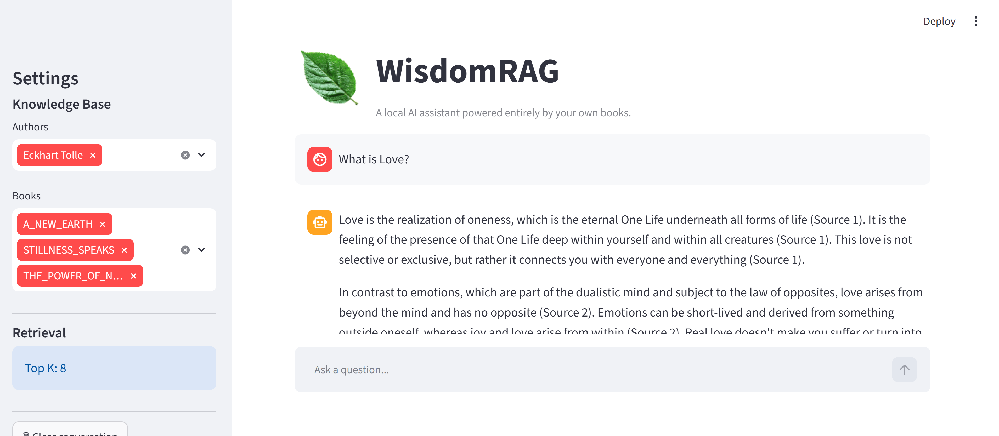
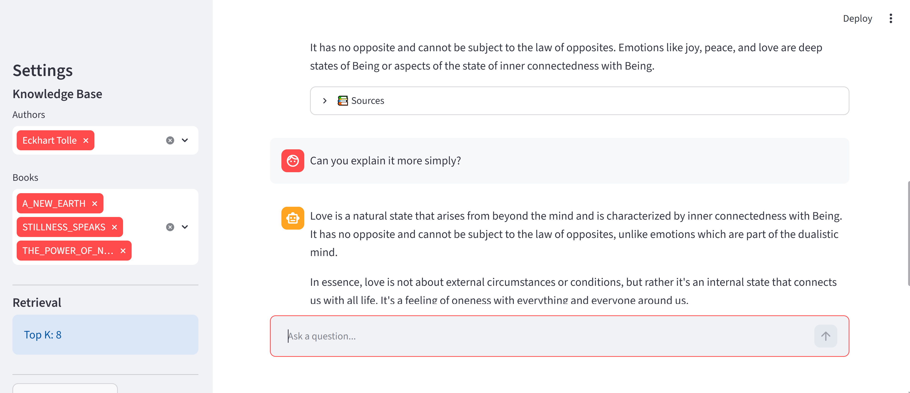

# 📚 WisdomRAG



<p align="left">
  
  
  
  
</p>

> **A fully local AI assistant that answers questions exclusively from your own books using Retrieval-Augmented Generation (RAG).**

WisdomRAG is an open-source Python application that answers questions **only from the documents you provide**. It combines a local Large Language Model (LLM), semantic search, vector embeddings, and Retrieval-Augmented Generation (RAG) into a fully offline AI assistant.

Unlike cloud-based AI assistants, WisdomRAG does **not** require an OpenAI API key and does **not** send your documents to external servers. Everything runs locally on your own computer using **Ollama**, **ChromaDB**, and **Python**.

---

# 🎯 Why Local AI?

Why use WisdomRAG instead of cloud-based AI solutions?

*   **Complete Privacy:** Your documents never leave your local machine. No external servers or third-party APIs are involved.
*   **Zero API Costs:** Run unlimited queries completely free of charge.
*   **No Internet Required:** Once downloaded, the entire pipeline operates fully offline.
*   **Strict Guardrails:** Answers are strictly restricted to your own verified documents, minimizing model hallucinations.
*   **Fully Customizable:** You control the knowledge base, the chunking parameters, and the prompt structures.
*   **Open-Source:** Transparent, auditable, and easy to extend.

---

# ✨ Features

*   🧠 **Fully Local AI Assistant:** Powered entirely by offline LLMs and embeddings.
*   🔒 **100% Private:** No cloud dependencies, API keys, or external telemetry.
*   📚 **Custom Knowledge Base:** Answers are generated only from your own provided PDF books.
*   💬 **Conversation Memory:** Remembers the context of previous questions for natural, multi-turn follow-ups.
*   🔎 **Retrieval-Augmented Generation (RAG):** Advanced semantic search ensures the LLM gets only the most relevant context.
*   🗂 **ChromaDB Vector Database:** High-performance local storage for your text embeddings.
*   📄 **Automatic PDF Processing:** Seamless ingestion of multi-directory PDF documents.
*   ✂️ **Intelligent Text Chunking:** Optimizes document segments to maintain local coherence.
*   📌 **Source Citations:** Generates automatic, clickable source attributions with exact page numbers.
*   👤 **Granular Metadata Filtering:** Instantly filter your search query by specific authors or individual books.
*   ⚡ **Streaming Responses:** Real-time token-by-token generation for a smooth user experience.
*   🚫 **Confidence Filter:** Prevents the language model from answering when the retrieved evidence is insufficient.
*   💻 **Clean Streamlit GUI:** A lightweight and responsive chat interface.

---

# 💡 Motivation

Large language models often mix information from many different sources, leading to factual errors and hallucinations.

WisdomRAG was designed to minimize hallucinations by generating answers only from retrieved passages in a user-provided knowledge base.

For example, you can build a private AI assistant that answers questions exclusively from:
*   Your favorite philosophers (e.g., Eckhart Tolle, OSHO, Ramana Maharshi)
*   Your own lecture and university notes
*   Internal company documentation and manuals
*   Specific research papers and textbooks

If the required information cannot be found in your documents, WisdomRAG simply replies:
> **"I could not find an answer to this question in the available input texts."**

---

# 🖼 Example

### Question
> What is love?

### Follow-up Question (Conversation Memory)
> Can you explain that in simpler words?

### Answer
Genuine love naturally appears when psychological identification with the ego dissolves... (Source 1)

### Sources
*   Eckhart Tolle — *The Power of Now*, page 81
*   OSHO — *The Book of Secrets*, page 213

---

# 🏗 Architecture

```
                     PDF Books
                          │
                          ▼
                  PDF Loader (PyMuPDF)
                          │
                          ▼
                   Text Cleaning
                          │
                          ▼
                 Intelligent Chunking
                          │
                          ▼
            Embeddings (nomic-embed-text)
                          │
                          ▼
              ChromaDB Vector Database
                          │
                          ▼
               Semantic Similarity Search
                          │
                          ▼
                 Confidence Verification
                          │
                          ▼
                Prompt Construction (RAG)
                          │
                          ▼
                Llama 3.2 (via Ollama)
                          │
                          ▼
              Streaming Answer + Citations
```

---

# ⚙ Technologies

*   **Python:** Core programming language.
*   **Ollama:** Local LLM runtime engine.
*   **Llama 3.2:** High-performance local 3B parameter model.
*   **ChromaDB:** Lightweight embedded vector database.
*   **PyMuPDF (fitz):** High-speed PDF text extraction.
*   **Streamlit:** Frontend web framework.
*   **Sentence Embeddings:** `nomic-embed-text` for advanced semantic vector representations.
*   **Retrieval-Augmented Generation (RAG):** Modern information retrieval combined with generative text.

---

# 📂 Project Structure

```
WisdomRAG/
│
├── app.py
├── requirements.txt
├── README.md
├── assets/
├── corpora/
├── src/
│
│   ├── chat_model.py
│   ├── chunker.py
│   ├── citations.py
│   ├── confidence.py
│   ├── config.py
│   ├── embeddings.py
│   ├── ingest.py
│   ├── models.py
│   ├── pdf_loader.py
│   ├── prompt_builder.py
│   ├── rag.py
│   ├── retriever.py
│   ├── search_filter.py
│   ├── text_cleaner.py
│   └── vector_store.py
│
├── tests/
└── chroma_db/
```

---

# 🚀 Installation & Setup

### 1. Clone the repository
```bash
git clone [https://github.com/YOUR_USERNAME/WisdomRAG.git](https://github.com/YOUR_USERNAME/WisdomRAG.git)
cd WisdomRAG
```

### 2. Create and activate virtual environment

Create it

```bash
python -m venv venv
```

Activate it

Windows

```bash
venv\Scripts\activate
```

Linux / macOS

```bash
source venv/bin/activate
```

Install the required packages

```bash
pip install -r requirements.txt
```

---

# 🤖 Install Ollama

Download and install Ollama for your OS:

https://ollama.com

Open your terminal/command prompt and pull the necessary models:

```bash
ollama pull llama3.2:3b
ollama pull nomic-embed-text
```

---

# 📚 Prepare your knowledge base

Create the following directory

```
corpora/
```

Ensure your PDF books are organized inside the corpora/ directory. Structure them by author name as folders:

Example:

```
corpora/spiritual/

    Eckhart Tolle/
        The Power of Now.pdf

    OSHO/
        Yoga_The_Alpha_and_the_Omega_Volume_1.pdf

    Sri Ramanasramam/
        WHO_AM_I?.pdf
```

---

# 🗃 Build the vector database

Run the ingestion script to process your PDF documents, generate embeddings, and store them in the local vector database:

```bash
python src/ingest.py
```

This step

* extracts text from PDF files
* cleans the text
* splits it into chunks
* computes embeddings
* stores everything inside ChromaDB
💡 Note: This step needs to be executed only once, or whenever new PDF documents are added to the corpora/ folder.

---

# ▶ Running the application

To launch the Streamlit graphical interface:

```bash
streamlit run app.py
```
After running this command, open the displayed local URL in your browser (usually http://localhost:8501).
---

# 💬 Example workflow

1. Select one or more authors.
2. Optionally select specific books.
3. Ask a question.
4. WisdomRAG retrieves the most relevant passages.
5. The LLM generates an answer **only from those passages**.
6. The answer is streamed token-by-token.
7. Citations are displayed automatically.

---

# 🔍 Confidence Filter

One of the main goals of this project is to reduce hallucinations.

Before generating an answer, WisdomRAG checks the semantic similarity between the user's question and the retrieved passages.

If the retrieved passages are not sufficiently similar, the language model is **not executed**.

Instead, the application returns

> **I could not find an answer to this question in the available input texts.**

This helps prevent unsupported answers.

---

# 📸 Screenshots

*(to be added)*

### Example Conversation & Citations




---

# 🎥 Video demonstration

A short video walkthrough of the application setup and performance is available on YouTube.

(Link will be added after publishing the video.)

---

# 📈 Possible Future Improvements

* Export Conversations: Save chat history to Markdown or PDF format.
* Multi-language Interface: Support for localized prompts and system outputs.
* Interactive Chunk Visualizer: A visual tool to inspect and debug the database chunks.
* Support for Additional Formats: Parsing and indexing .txt, .docx, and .epub files.
* Author Comparison Mode: Compare different viewpoints of multiple authors on the same topic side-by-side.

---

# 📄 License

This project is licensed under the MIT License - see the LICENSE file for details.

---

# 👤 Author

Developed by Peter Les

GitHub: https://github.com/peter-les

YouTube: https://www.youtube.com/@PeterLes11

If you find this project useful, feel free to star ⭐️ the repository! and subscribe my YouTube channel!
